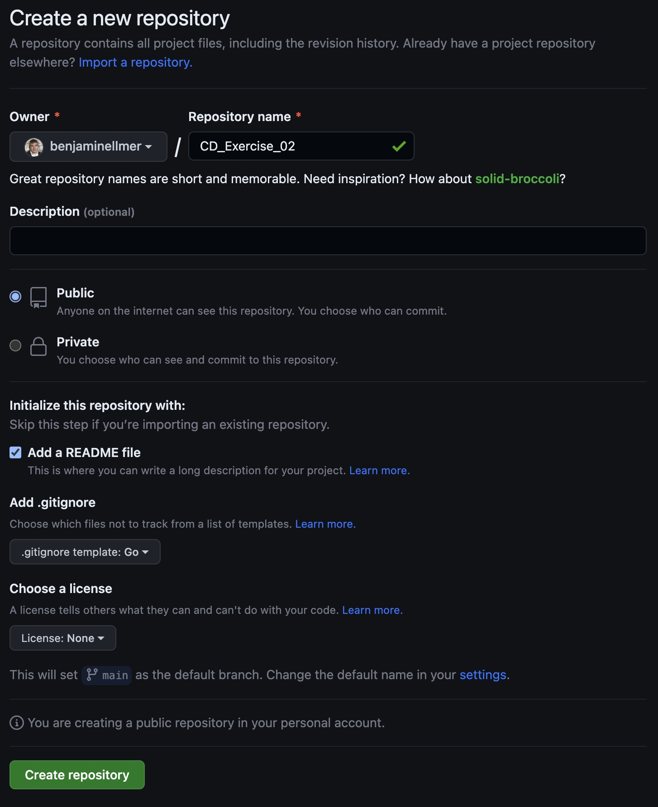

# Steps
## Postgres Setup
Create postgres container using docker:
```bash
docker run --name postgres -p 5432:5432 -e POSTGRES_PASSWORD=postgres -d postgres 
```

Open postgres shell in container and create Table
```bash
docker exec -it postgres psql -U postgres
CREATE TABLE products(
    id SERIAL,
    name TEXT NOT NULL,
    price NUMERIC(10,2) NOT NULL DEFAULT 0.00,
    CONSTRAINT products_pkey PRIMARY KEY (id)
);
```

## Setup Github Repo


Clone repo:
```bash
git clone git@github.com:benjaminellmer/CD_Exercise_02.git
cd CD_Exercise_02
```
